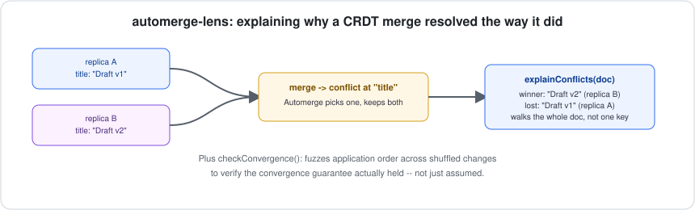
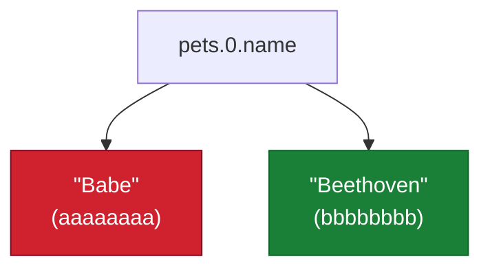

# automerge-lens

[](https://github.com/jayblast-spec/automerge-lens/actions/workflows/ci.yml)
[](https://www.npmjs.com/package/automerge-lens)
[](./LICENSE)



**Explains why an [Automerge](https://automerge.org) CRDT merge resolved the way it did, and empirically fuzzes application order to catch convergence violations — the debugging tooling local-first frameworks are missing.**

## The gap this fills

Local-first / CRDT tooling matured fast through 2026 — mature libraries (Automerge, Yjs, Loro), production sync engines (PowerSync, ElectricSQL, Zero). But the debugging side lagged behind on purpose: CRDTs guarantee your data *converges*, not that you can see *why* it converged to what it did. When two replicas edit the same field concurrently, Automerge deterministically resolves the conflict — but today the only way to know a conflict even happened is to manually call `getConflicts()` at the exact path where you suspect one, and there's no tooling that walks a whole document for you, and nothing that verifies the underlying convergence guarantee actually held for a given set of changes.

## What it does

Three independent, composable pieces of Automerge tooling:

### `getCausalHistory(doc)`
Every change in the document's full history, topologically sorted by its `deps` so causality is always visible — not just whatever order the underlying store happens to return.

### `explainConflicts(doc)`
Recursively walks the entire document (not just one path you already suspect), and for every key with a live conflict reports **every candidate value, which actor wrote it, and which one automerge currently presents** — so a conflict isn't just "detected," it's explained.

### `checkConvergence(changes, options)`
The one thing a CRDT promises is that applying the same changes in *any* order produces the same final state. This applies a flat set of changes (gathered from any number of diverged replicas) in many random orders and asserts they all converge to identical heads. If they don't, that's a real bug — almost always non-deterministic or side-effecting code inside a `change()` callback, which Automerge itself has no way to catch for you. Runs are seeded, so a failure is reproducible.

### `historyToMermaid(history)` / `conflictsToMermaid(reports)`
A JSON array of changes is not how a person actually wants to look at a merge history. These render `getCausalHistory` and `explainConflicts` output as [Mermaid](https://mermaid.js.org) diagrams — paste the output into a ` ```mermaid ` fenced block anywhere that renders Markdown (GitHub does this natively, no library needed) and get an actual picture instead of a wall of hashes.

For the classic concurrent-edit scenario from Automerge's own docs (two actors both rename the same pet), the conflict graph looks like this:



## Install

```bash
npm install automerge-lens @automerge/automerge
```

## Usage

```ts
import * as Automerge from "@automerge/automerge";
import { getCausalHistory, explainConflicts, checkConvergence } from "automerge-lens";

const merged = Automerge.merge(doc1, doc2);

for (const report of explainConflicts(merged)) {
  console.log(`Conflict at ${report.path.join(".")}`);
  for (const entry of report.entries) {
    console.log(`  ${entry.isCurrentValue ? "WON " : "lost"} "${entry.value}" (actor ${entry.actor})`);
  }
}

const result = checkConvergence([...Automerge.getAllChanges(doc1), ...Automerge.getAllChanges(doc2)]);
if (!result.converged) throw new Error("convergence violated -- see result.divergence");
```

Run the annotated demo (the exact conflict scenario from Automerge's own docs, explained):

```bash
npx tsx examples/demo.ts
```

## Non-goals (v1)

- **Not a replacement for Automerge's own APIs** — it's a thin, well-tested layer that makes existing APIs (`getConflicts`, `getAllChanges`, `decodeChange`) actually usable for whole-document debugging, not a reimplementation of them.
- **Automerge only in v1.** Yjs and Loro have different internal models (no `getConflicts`-equivalent API in the same shape); a v2 direction, not silently half-supported here.
- **Static diagrams, not a live interactive UI.** `historyToMermaid`/`conflictsToMermaid` produce Mermaid source you render (GitHub, most Markdown/docs tools do this for free); a live, clickable, in-browser visualizer is a natural next step, not v1 scope.

## Development

```bash
npm install
npm run typecheck
npm test
npm run build
```

## License

MIT
